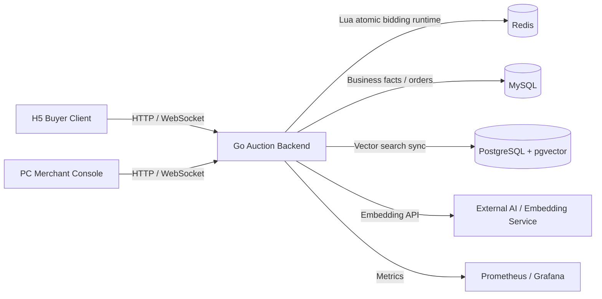

# ByteDanceliveauctioni

LiveAuction is a full-stack live commerce auction demo built for the Douyin E-commerce AI full-stack challenge. It contains a Go backend, a React merchant console, and a mobile H5 buyer client that together cover lot creation, live bidding, order settlement, real-time synchronization, and AI-assisted search/recommendation.

## Project Overview

The system models a live auction workflow:

1. Merchants create lots, configure bidding rules, and start live auction sessions from the PC console.
2. Buyers enter the H5 live room, view current lots, place bids, and receive real-time state updates.
3. The backend validates bids, resolves winners, creates orders, and projects auction facts for query and analytics.
4. Redis handles hot real-time auction runtime state, while MySQL stores the final auditable business facts.
5. WebSocket pushes price, ranking, countdown, and settlement events to buyers and merchant screens.

## Repository Structure

```text
ByteDanceliveauctioni/
├── live-auction-bid-backend/   # Go auction backend, Redis runtime, MySQL facts, WebSocket events
├── live-auction-bid-frontend/  # PC merchant/admin console built with React + TypeScript + Vite
├── live-auction-user-h5/       # Mobile H5 buyer client built with React + TypeScript + Vite
├── README.md
├── SECURITY.md
├── LICENSE
└── .gitignore
```

## Architecture



## Core Capabilities

- Real-time bidding with Redis Lua atomic decision logic.
- Hot runtime state and final fact storage split between Redis and MySQL.
- WebSocket event push with snapshot recovery after reconnect.
- Auction state machine for queued, live, extended, settled, cancelled, failed, and expired lots.
- Merchant data cockpit for GMV, orders, payment status, and live operating metrics.
- AI-assisted semantic lot search and recommendation through embedding + vector retrieval.

## Requirements

- Go 1.22+
- Node.js 20+
- npm 10+
- Docker and Docker Compose
- MySQL 8.4
- Redis 7.2
- Optional: PostgreSQL + pgvector for semantic search

## Local Startup

Start backend dependencies and service. The default Docker Compose profile uses local file storage, mock AI responses, MySQL, Redis, Consul, Prometheus, and Grafana, so no cloud keys are required for a working demo.

```bash
cd live-auction-bid-backend
cp deploy/.env.example deploy/.env
make docker-up
```

Verify the backend:

```bash
curl http://127.0.0.1:18080/healthz
curl http://127.0.0.1:18080/readyz
```

Default merchant account:

```text
username: main
password: main_dev_password
```

Start the PC merchant console:

```bash
cd live-auction-bid-frontend
npm ci
npm run dev -- --host 0.0.0.0 --port 5173
```

Start the H5 buyer client:

```bash
cd live-auction-user-h5
cp .env.example .env.local
npm ci
npm run dev -- --host 0.0.0.0 --port 5174
```

Local URLs:

| App | URL |
| --- | --- |
| PC merchant console | `http://127.0.0.1:5173` |
| H5 buyer client | `http://127.0.0.1:5174` |
| Backend API | `http://127.0.0.1:18080` |
| Grafana | `http://127.0.0.1:13000` |
| Prometheus | `http://127.0.0.1:19090` |

## Configuration

All sensitive runtime values must be provided through environment variables or local `.env` files. Public examples are provided as `.env.example` files only.

Common backend variables:

```text
AUCTION_MYSQL_DSN
AUCTION_REDIS_ADDR
AUCTION_REDIS_PASSWORD
AUCTION_JWT_SECRET
AUCTION_BOOTSTRAP_MAIN_ACCOUNT_USERNAME
AUCTION_BOOTSTRAP_MAIN_ACCOUNT_PASSWORD
AUCTION_STORAGE_PROVIDER
AUCTION_LOCAL_STORAGE_DIR
AUCTION_LOCAL_STORAGE_PUBLIC_BASE_URL
AUCTION_EMBEDDING_API_KEY
AUCTION_AI_API_KEY
```

`AUCTION_STORAGE_PROVIDER=local` is the default public-delivery mode. Switch to `tos` only when deploying with real object-storage credentials.

Do not commit real `.env` files, server credentials, cloud keys, or production secrets.

## Verification

Backend:

```bash
cd live-auction-bid-backend
go test ./app/auction/service/internal/biz/auction
```

PC frontend:

```bash
cd live-auction-bid-frontend
npm ci
npm run build
```

H5:

```bash
cd live-auction-user-h5
npm ci
npm run build
npm test
```

## Delivery Notes

- This public delivery repository keeps the main source history of the three original projects after sensitive-history filtering.
- The submitted production shape is a single-node deployment. Cluster routing, shard gateway, and multi-node operations remain reserved extension directions and are not claimed as finalized delivery features here.
- Runtime screenshots, Feishu project documents, and challenge demo links should be attached from the final submission page rather than committed with secrets or private environment files.
- Project contributors: Ye-yellow, XB-Dong (https://github.com/XB-Dong)